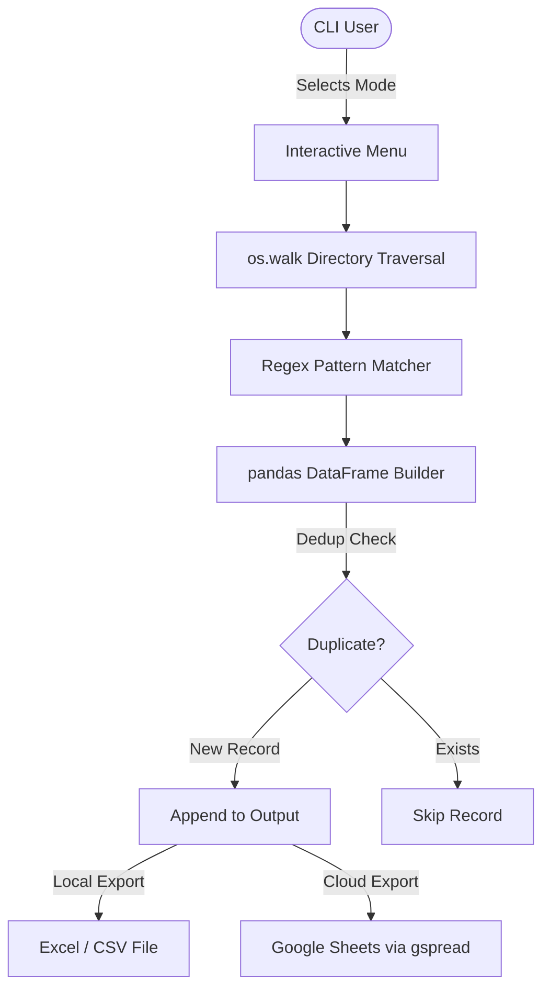

# Architecture Documentation

## Core Components

**Drive-Data** is a single-script Python CLI application structured around three logical layers:

### 1. CLI Interface Layer
- An interactive, numbered text menu printed to the terminal.
- Handles user selection for directory scope (All Clients, Consultants, Both, Custom Path) and output destination (Local, Google Sheets, Both).

### 2. Directory Scanning & Pattern Matching Layer
- Recursively traverses the configured directory paths using `os.walk`.
- For each file found, applies a predefined set of regex patterns to classify the document into a trademark category (TM-1, TM-48, EXAM, ACK, etc.).
- Builds a structured list of dictionaries from the matched results.

### 3. Export Layer
- **Local:** Converts the list to a `pandas` DataFrame and exports via `openpyxl` to `.xlsx` and `.csv`.
- **Google Sheets:** Uses `gspread` with Google Service Account authentication to fetch existing sheet rows, compute a de-duplication key, and append only new records.

## Data Flow Diagram

---

## 👨‍💻 Credits

**By OutLawZ™**

Website: https://www.brandex.pk

Contact:

📧 Email: net2tara@gmail.com
🌐 Website: https://www.brandex.pk

---
Made with ❤️ by OutLawZ™
