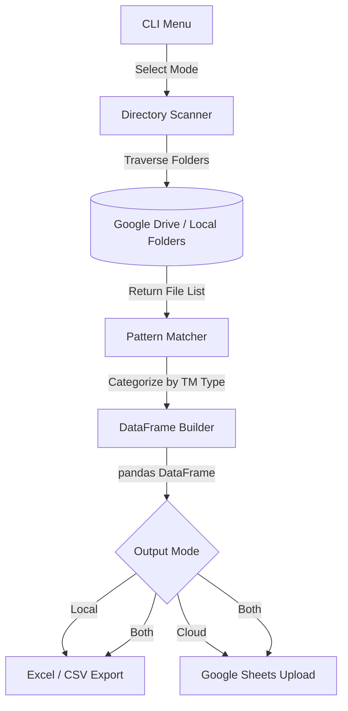
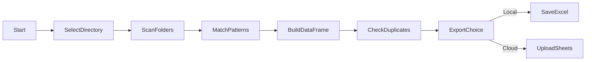

# 🎬 Drive-Data Parser

---

# Description

**Drive-Data** is a Python-based command-line utility for parsing Google Drive folder structures and extracting structured trademark case information. It intelligently scans directory trees to identify and categorize trademark documents (TM-1, TM-48, EXAM, ACK, etc.) using pattern matching. The parsed data can be uploaded directly to Google Sheets via service account credentials or exported locally to Excel and CSV formats.

---

# 🚀 Features

- **Directory Parsing:** Recursively parses client and consultant folder structures from Google Drive (or local mirrors).
- **Pattern Matching:** Automatically detects and categorizes trademark documents into standardized categories (TM-1, TM-48, EXAM, ACK, etc.).
- **Google Sheets Upload:** Pushes parsed data directly into a Google Sheet using service account authentication with duplicate control.
- **Local Export:** Exports results to Excel (`.xlsx`) and CSV files in a configurable export directory.
- **Quick Export Mode:** Fast export without deep pattern matching for rapid reporting.
- **Batch Processing:** Supports processing a specific number of records for testing and validation.
- **Interactive Menu:** CLI menu system for selecting directory scope and upload target.

---

# 🛠️ Tech Stack

| Layer | Technology |
| --- | --- |
| **Language** | Python 3.x |
| **Data Manipulation** | `pandas`, `openpyxl` |
| **Google Integration** | `gspread`, `google-auth` |

---

# 📂 Project Structure

```text
Drive-Data/
├── main.py              # Main CLI application — directory parsing, pattern matching, export logic
├── requirements.txt     # Python dependencies
├── credentials.json     # Google Service Account credentials (gitignored)
├── exports/             # Exported Excel/CSV files (gitignored)
└── README.md            # Documentation
```

---

# 📄 Important Files

| File | Purpose |
| --- | --- |
| `main.py` | The entire business logic: directory traversal, regex pattern matching, Google Sheets integration, and CLI menu. |
| `credentials.json` | Google Cloud service account key. **Never commit this file to source control.** |

---

# 🏗️ Architecture Diagram



---

# 🔄 Processing / Data Flow



---

# 📥 Inputs

- **Directory Paths:** Google Drive folder paths (configurable in `main.py`).
- **Pattern Definitions:** Document category regex patterns embedded in the script.
- **Credentials:** Google Service Account JSON for Sheets API authentication.

---

# 📤 Outputs

- **Google Sheets:** Structured spreadsheet with trademark case rows per client/consultant.
- **Excel File:** `.xlsx` export inside `exports/` directory.
- **CSV File:** Flat `.csv` alternative export.

---

# 🏎️ Quick Start

```bash
# Install dependencies
pip install -r requirements.txt

# Place your credentials.json in the project root
# Configure SHEET_ID, SHEET_NAME, EXPORT_DIR in main.py

# Run the tool
python main.py
```

---

# ⚙️ Configuration

Edit these constants at the top of `main.py`:
```python
SHEET_ID = "your_google_sheet_id"
SHEET_NAME = "List"
EXPORT_DIR = r"path\to\exports"
```

---

# 🎯 Pattern Categories

| Category | Document Type |
| --- | --- |
| `TM-1` | Trademark application forms |
| `TM-48` | Trademark registration certificates |
| `EXAM` | Examination reports and showcase notices |
| `ACK` | Acknowledgment receipts |
| `ACCEPTANCE` | Acceptance documents |
| `D-NOTE` | Demand notes (TM-11) |
| `TM-16` | Trademark renewal documents |
| `TM-50` | Trademark opposition documents |
| `TM-06` | Other trademark forms |
| `COMPANY` | Board resolutions |
| `OPPO` | Withdrawn letters |
| `PUB` | Publication documents |
| `CERTIFICATE` | Trademark certificates |

---

# 🔒 Security Notes

- **credentials.json** is in `.gitignore`. Never commit service account keys to repositories.
- Limit the service account's Google Drive and Sheets permissions to the minimum required scope.

---

# 🚧 Roadmap

- Add a GUI (Tkinter or web) to replace the CLI menu.
- Implement automatic scheduling via cron/Task Scheduler for nightly syncs.
- Add email notifications on completion or error.

---

# 📝 License

MIT License

---

## 👨‍💻 Credits

**By OutLawZ™**

Website: https://www.brandex.pk

Contact:

📧 Email: net2tara@gmail.com
🌐 Website: https://www.brandex.pk

---
Made with ❤️ by OutLawZ™
