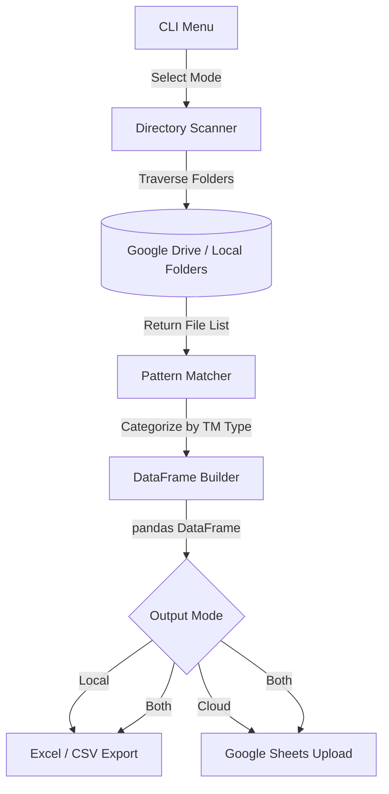
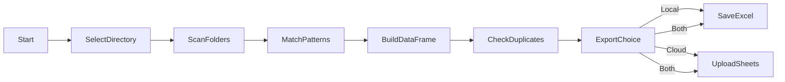

# 🗂️ Drive Folders List

> **A smart Google Drive folder parser that extracts, categorizes, and exports trademark case data to Google Sheets or local Excel/CSV files.**

---


---

## 📖 Description

**Drive Folders List** is a Python command-line tool designed for trademark law firms and IP professionals. It scans Google Drive–mirrored folder structures (organized by client and case), extracts structured information from folder names, and automatically detects trademark document types (TM-1, TM-48, EXAM, ACK, etc.) using pattern matching.

Results can be pushed directly to a **Google Sheet** via a service account, or exported locally to **Excel (.xlsx)** and **CSV** files — with full duplicate prevention built in.

### 🏷️ Tags

`google-drive` · `google-sheets` · `trademark` · `ip-management` · `folder-parser` · `python` · `automation` · `pattern-matching` · `pandas` · `gspread` · `cli-tool` · `excel-export` · `service-account` · `data-extraction` · `file-scanner`

---

## 🚀 Features

- 📁 **Folder Structure Parsing** — Recursively scans client/consultant directories and extracts client numbers, case IDs, TM numbers, and class codes from folder names.
- 🔍 **Pattern Matching** — Automatically detects and categorizes trademark documents (TM-1, TM-48, EXAM, ACK, Certificates, etc.) using regex rules.
- ☁️ **Google Sheets Upload** — Pushes data directly to a Google Sheet using service account credentials with **automatic duplicate control**.
- 💾 **Local Export** — Saves results as `.xlsx` and `.csv` into a configurable export directory.
- ⚡ **Quick Export Mode** — Rapid export without deep pattern matching for fast reporting.
- 🔢 **Batch Limiting** — Optionally cap the number of records processed for testing.
- 🖥️ **Interactive CLI Menu** — Simple numbered menu to pick directories and upload targets.

---

## 🛠️ Tech Stack

| Layer | Technology |
| --- | --- |
| **Language** | Python 3.x |
| **Data Manipulation** | `pandas`, `openpyxl` |
| **Google Integration** | `gspread`, `google-auth` |
| **File I/O** | `pathlib`, `os` |
| **Pattern Matching** | `re` (regex) |

---

## 📂 Project Structure

```text
Drive-Data/
├── main.py              # Core CLI: directory parsing, pattern matching, export logic
├── requirements.txt     # Python dependencies
├── credentials.json     # Google Service Account key (gitignored — do NOT commit)
├── export/              # Auto-created output directory for Excel/CSV files
└── README.md            # This documentation
```

---

## 📄 Key Files

| File | Purpose |
| --- | --- |
| `main.py` | Full application logic: traversal, regex matching, Google Sheets auth, CLI menu |
| `credentials.json` | Google Cloud service account JSON key — place in project root, **never commit** |
| `requirements.txt` | Python package dependencies |

---

## 🏗️ Architecture



---

## 🔄 Data Flow



---

## 🏎️ Quick Start

```bash
# 1. Clone the repo
git clone https://github.com/0utLawzz/Drive-Data.git
cd Drive-Data

# 2. Install dependencies
pip install -r requirements.txt

# 3. Place your credentials.json in the project root
#    (Google Cloud service account key with Sheets + Drive access)

# 4. Configure your Google Sheet ID and folder paths in main.py
#    SHEET_ID = "your_google_sheet_id"
#    consultants_path = r"path\to\2 CONSULTANTS"
#    clients_path = r"path\to\1 ALL CLIENTS"

# 5. Run
python main.py
```

---

## ⚙️ Configuration

Edit these constants at the top of `main.py`:

```python
SHEET_ID   = "your_google_sheet_id"   # Google Sheet ID from the URL
SHEET_NAME = "List"                   # Target worksheet tab name
```

And update the folder paths inside `main()`:

```python
consultants_path = r"F:\YourDrive\2 CONSULTANTS"
clients_path     = r"F:\YourDrive\1 ALL CLIENTS"
```

> **Note:** `credentials.json` is auto-located from the same directory as `main.py` — no hardcoded path needed.

---

## 🎯 Pattern Categories

| Column | Document Type Detected |
| --- | --- |
| `TM-1` | Trademark application forms |
| `TM-48` | Registration / updated registration docs |
| `EXAM` | Examination reports, showcase notices, replies |
| `ACK` | Acknowledgment receipts |
| `ACCEPTANCE` | Acceptance / complete file documents |
| `D-NOTE` | Demand notes (TM-11) |
| `TM-16` | Renewal documents |
| `TM-50` | Opposition documents |
| `TM-06` | Other IPO trademark forms |
| `COMPANY` | Board of resolution documents |
| `OPPO` | Withdrawn letters |
| `PUB` | Publication records |
| `CERTIFICATE` | Trademark certificates (original / renewal) |

---

## 📥 Inputs

- **Folder Paths** — Local mirrors of Google Drive folders (configurable in `main.py`)
- **Pattern Definitions** — Regex rules embedded per document category
- **credentials.json** — Google Service Account key for Sheets API

---

## 📤 Outputs

| Output | Format | Location |
| --- | --- | --- |
| Google Sheets | Live spreadsheet | Configured `SHEET_ID` |
| Excel | `.xlsx` | `export/` directory |
| CSV | `.csv` | `export/` directory |

---

## 🔒 Security Notes

- `credentials.json` is listed in `.gitignore` and **must never be committed**.
- The service account should only have scopes for `spreadsheets` and `drive` — no broader permissions.
- Rotate the service account key periodically via Google Cloud Console.

---

## 🚧 Roadmap

- [ ] Add a GUI (Tkinter or web-based) to replace the CLI menu
- [ ] Implement automatic scheduling via Windows Task Scheduler or cron
- [ ] Add email/Slack notifications on completion or error
- [ ] Support multi-sheet output (one sheet per client)

---

## 📝 License

MIT License © OutLawZ™

---

## 👨‍💻 Credits

**By OutLawZ™**

🌐 Website: [brandex.pk](https://www.brandex.pk)
📧 Email: net2tara@gmail.com

---

*Made with ❤️ by OutLawZ™*
